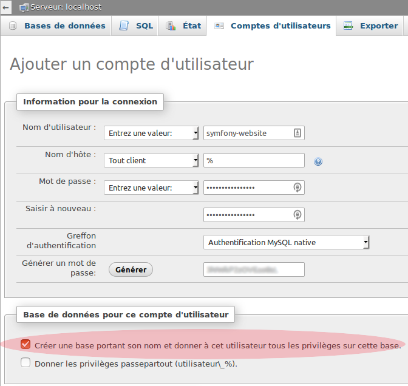

# Clone directory

```
git clone https://github.com/xbros/website-symfony.git chosen-project-name
```

De préférence dans dossier lamp, ex: `/var/www/html/xbros`

# Installer symfony à partir du directory créé

Placer le fichier composer.phar dans le même dossier parents du projet.
Il devrait donc y avoir dans le dossier parent :

- `composer.phar`
- le dossier du projet

On le place ici car il peut être utiliser pour plusieurs projets symfony, et il ne fait pas partie du projet.

On se place maintenant dans le dossier du projet et on lance la commande suivante :

```
php ../composer.phar install
```

# Configuration base de données

Dans PhpMyAdmin,
Tu dois créer un nouvel utilisateur avec une base de données dont il a tous les droits.
C’est facile il y une checkbox pour cela :



Ensuite il faut que tu importes la structure et le contenu de la base de données.

Pour cela sélectionne la base, tu vas dans l’onglet importer et tu upload le fichier `symfony-website.sql`.

Maintenant que tu as la base de données en place il faut dire à symfony qu’il peut l’utiliser.
Dans le projet, tu modifies le fichier `app/config/parameters.yml` :

```
# This file is auto-generated during the composer install
parameters:
database_host: 127.0.0.1
database_port: null
database_name: symfony-website
database_user: symfony-website
database_password: <XXXXXXXXXXX>
mailer_transport: smtp
mailer_host: 127.0.0.1
mailer_user: null
mailer_password: null
secret: ThisTokenIsNotSoSecretChangeIt
```

Tu dois simplement remplir les champs :

- `database_name`
- `database_user`
- `database_password`

avec les informations de la base de données que tu as créé avant

# Ajout des sons

Il faut que tu télécharge tout le dossier

`/home/simon/public_html/website/web/simon-music`

et que tu le place au même endroit dans ton projet local (dans le dossier web).

Si tu n’as pas envie de trop télécharger (y’a des fichiers bien lourd), prends-en que quelques-uns.
Prend cependant les 3 fichiers au même nom (.wav, .mp3 et .jpg).

Tu auras cependant des trous dans la liste des sons, mais ça n’empêche pas de faire des tests avec ceux présents

# Voilà ! Good Luck Have Fun (GLHF)

Après tout ce merdier tu devrais pouvoir commencer à entrer dans la compréhension de l’architecture que je préfère qu’on voit ensemble plutôt que de te le détailler ici.

Tu peux juste tester si tout marche bien en ouvrant le fichier web/app_dev.php qui correspond à la partie de développement du site. Les modifications ne se voient que de ce côté.

Pour faire basculer de `app_dev.php` vers `app.php` (partie production publique) on utilise la
commande

```
php app/console cache:clear --env=prod
```

qui supprime tout le cache de la partie production. Cette commande se lance depuis la racine du projet.

J’ai peut-être oublié des trucs, donc si tu as un message d’erreur en arrivant sur le fichier `app_dev.php` dis le moi.

Essaye ensuite de te balader sur le site pour être sûr que tout fonctionne.

N’essaye pas la modification et l’ajout de son ce n’est pas fini du tout.


# Droits d'accés

https://openclassrooms.com/courses/developpez-votre-site-web-avec-le-framework-symfony2/symfony2-un-framework-php#/id/r-3071143


En local (sans ACL):

```
rm -rf app/cache/*
rm -rf app/logs/*
chmod 777 -R app/cache
chmod 777 -R app/logs
```

# Structure du code

## `app/config`

- `parameters.yml`: parametres globaux
- `config.yml`: quelques variables custom comme

```
simon_music_directory: '%kernel.root_dir%/../web/simon-music'
```

- `routing.yml`: mettre en lien les differents bundle

### `Resources/views`

- `layout.html.twig`: template global pour tout le site

## `web`

TODO: cloner rubik ici

- `app_dev.php`: la ligne 15 contient les IPs autorisées pour la partie dev

## `src/XbrosBundle`

Note: Bundle = une grosse partie de site

- `Resources/config/routing.yml`: definit les routes des urls: quelle méthode du controller appeler par url
- `Controller/DefaultController.php`: methodes qui affichent les pages
- `Ressources/views/Default/*.html.twig`: templates de chaque page qui étendent le layout global


## `src/AdminBundle`

`Entity` contient des classes pour causer avec la bdd.
Toutes les entity sont placées seulement dans le bundle AdminBundle.

- `Entity/SimonMusic.php`: utilise syntaxe Doctrine en commentaires

- `Ressources/config/routing.yml`: routes de la partie admin
- `Controller/DefaultController.php`: 
